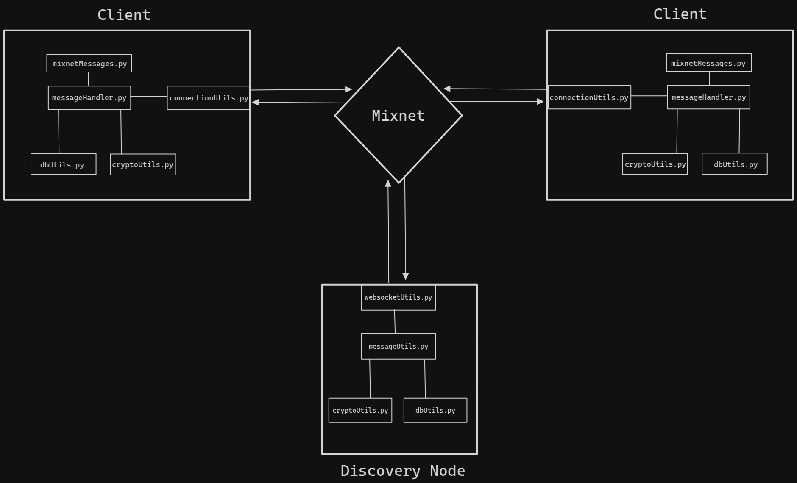
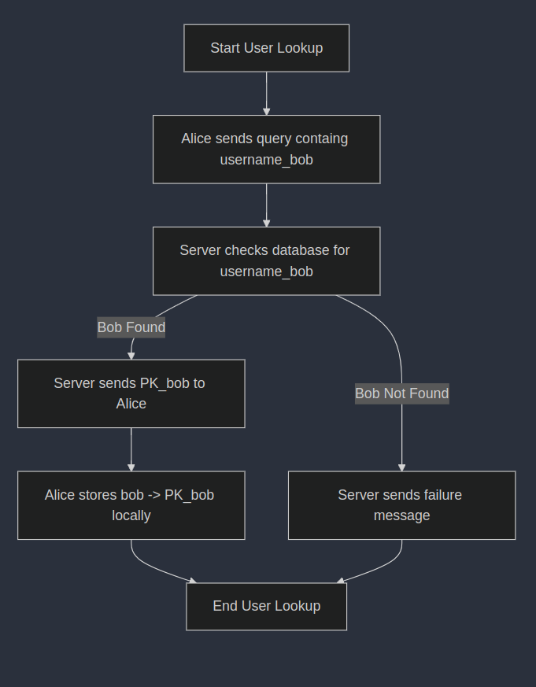
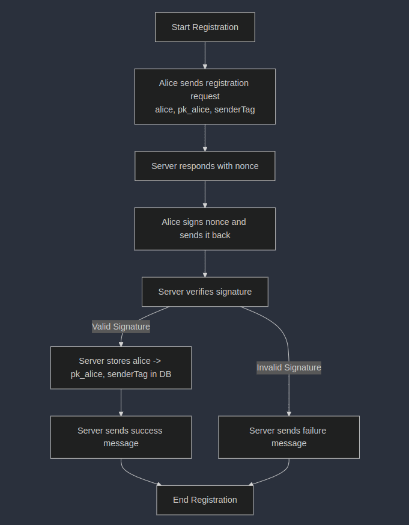

# nymCHAT

A privacy focused messaging app powered by the Nym Mixnet. The repo is divided into two parts: the **Chat Client** (in the _client_ folder) and the **Discovery Node** (in the server folder). Together they enable pseudonymous, end-to-end encrypted messaging.

---

## Overview

Users register a public key and username with a discovery node. The discovery node provides lookup & message relaying. Nodes maintain a database mapping each username to its corresponding public key and a `senderTag`. 

Sender tags are random strings derived from received SURBs. Single Use Reply Blocks (SURBs) allow the server to forward messages to clients without ever knowing the destination of the message. 

Initially, messages are routed through the discovery node; however, clients can exchange an encrypted handshake to enable direct client-to-client communication for an extra layer of privacy.

---

## Architecture Overview

nymCHAT implements a pseudonymous message routing system with two key components:

1. **Discovery Node Server**: 
   - Manages username → (public_key, senderTag) mappings
   - Handles user registration with cryptographic challenge-response
   - Routes messages between clients via ephemeral SURB channels
   - Never learns message content due to end-to-end encryption

2. **Client Application**:
   - NiceGUI-based frontend 
   - Uses ECDH + AES-GCM for end-to-end message encryption
   - Implements ephemeral "handshakes" for direct p2p routing
   - Stores contacts and messages in SQLite database

---

## Security Properties

- **Transport Privacy**: All traffic routed through Nym mixnet with sphinx packet format
- **Message Privacy**: End-to-end encrypted using ECDH with ephemeral keys + AES-GCM
- **Authentication**: Signature verification using long-term EC keys (SECP256R1)
- **Pseudonymity**: Username registration with no linkage to real identity
- **Direct Communication**: Optional p2p mode bypasses discovery node after initial contact

---

## Protocol

`alice` wants to send a message to her friend `bob`.

**Client Registration**:

- Alice sends a registration request containing `(alice, pk_alice, SURB)` to a server.
- The server responds with a nonce.
- Alice signs the nonce and sends it back to the server.
- The server verifies the signature, if successful adds `alice -> pk_alice, senderTag` to the DB and responds with a success message.

**User Lookup**

- Alice sends a query to the server, containing `(bob, SURB)`.
- The server receives the message and checks it's DB for `bob`.
-  If it has an entry, it forwards `PK_bob` to alice via `SURB`.
- Alice stores `bob -> PK_bob` in her local contacts table.

**Message Sending**:

- Alice uses `PK_bob` and an ephemeral keypair `(SK_tmp, PK_tmp)` to derive a shared secret, then encrypts the message and encapsulates it into a payload.
- She attaches `PK_tmp` for bob to derive the same shared secret. Since this is her first message to Bob, she also attaches `PK_alice`. Alice signs the payload for Bob to verify.
- Alice then encapsulated this payload into the proper format, and signs the entire outer payload for the server to verify.
- This message is sent to the server, addressed to Bob.
- The server verifies the outer signature against Alice's stored public key and the message payload. If successful, the server queries it's local db for Bob and retrieves the associated `senderTag`.
- The server forwards the encrypted message to Bob via `SURB`.
- Bob receives the encrypted message and parses `PK_alice` and `PK_tmp` from it. Bob verifies the signature using `PK_Alice`. If successful, he uses `PK_tmp` to derive the same shared secret and decrypts the message.

---

## TODO

- Group chats
- MLS Cryptography
- Federated network of discovery nodes